# homelab

HP Elitebook requires disabling power management to stop random reboots. _i915.enable_dc=0_ needs to be added to the *GRUB_CMDLINE_LINUX_DEFAULT*
value in `/etc/default/grub`.

```text
GRUB_CMDLINE_LINUX_DEFAULT="i915.enable_dc=0 intel_idle.max_cstate=7"
```

Then update grub and reboot the system

```shell
sudo update-grub
sudo shutdown -r now
```

The nginx reverse proxy diagram.



## ubuntu upgrades

```shell
sudo apt-get --with-new-pkgs upgrade # upgrades held back packages
```

## changing from docker snap to native docker

```shell
sudo snap stop docker
sudo install -m 0755 -d /etc/apt/keyrings
curl -fsSL https://download.docker.com/linux/ubuntu/gpg | sudo gpg --dearmor -o /etc/apt/keyrings/docker.gpg
sudo chmod a+r /etc/apt/keyrings/docker.gpg
echo   "deb [arch=$(dpkg --print-architecture) signed-by=/etc/apt/keyrings/docker.gpg] https://download.docker.com/linux/ubuntu \
  $(lsb_release -cs) stable" | sudo tee /etc/apt/sources.list.d/docker.list > /dev/null
sudo apt update
sudo apt install -y docker-ce docker-ce-cli containerd.io docker-buildx-plugin docker-compose-plugin
sudo systemctl enable docker
sudo systemctl start docker
sudo systemctl status docker
sudo rsync -a /var/snap/docker/common/var-lib-docker/ /var/lib/docker/
sudo snap remove docker
/usr/bin/docker compose up -d # bring up the rest of the stack
```

## certificates for a homelab

* Provision a CA. See the [gen-certs.sh](./gen-certs.sh) script.
* Use the CA to create self-signed certificates for nginx/application
* Import and trust the CA on machines in your lab. Use AirDrop to copy the CA to iPhone. Add the Profile in VPN management and then trust the CA in "Settings -> About". For macOS, use KeyChain Access to import the CA and then change the Trust Level.

## coredns for local home domain

Router updated to use the ip address of the host running the docker container of coredns via host network mode.
Added prometheus and cache plgins to the Corefile.
Change the local machine to use CoreDNS.

Install coredns

```shell
sudo mkdir /etc/coredns
sudo cp coredns/* /etc/coredns/
wget https://github.com/coredns/coredns/releases/download/v1.12.3/coredns_1.12.3_linux_amd64.tgz
mv coredns_1.12.3_linux_amd64.tgz /tmp
tar xzf -C /tmp coredns_1.12.3_linux_amd64.tgz
chmod +x /tmp/coredns
sudo mv /tmp/coredns /usr/local/bin
```

Set the content of `/etc/systemd/system/coredns.service`

```text
[Unit]
Description=CoreDNS DNS Server
After=network.target
[Service]
Type=simple
ExecStart=/usr/local/bin/coredns -conf /etc/coredns/Corefile
[Install]
WantedBy=multi-user.target
```

Start the CoreDNS service

```shell
sudo systemctl daemon-reload
sudo systemctl start coredns
sudo systemctl status coredns
sudo systemctl enable coredns
```

### change the local resolver to use coredns

```shell
# edit  /etc/systemd/resolved.conf
# set the below value
DNSStubListener=no

# Then apply your changes by running the following command:

sudo systemctl restart systemd-resolved
```

You may need to also change the `/etc/resolv.conf` file too

* DNS [reference](https://di-marco.net/blog/it/2024-05-09-Intall_and_configure_coredns/#disable-stub-resolver()
* CoreDNS [reference](https://ipv6.rs/tutorial/Ubuntu_Server_Latest/CoreDNS/)

## prometheus

### update the config for a live reload

```shell
curl --insecure -X POST https://prometheus.homelab.int/-/reload
```

## grafana

Reset the admin user pasword

```shell
docker compose exec grafana /bin/sh
grafana cli admin reset-admin-password admin
```

* coredns [dashboard](https://grafana.com/grafana/dashboards/15762-kubernetes-system-coredns/).
* node-exporter: import dashboard 1860 and set Job to `node-exporter`.

## node--exporter

Runs in host mode and therefore the prom scrape address needs to be the machine host IP address.

## references

* Homelab [CoreDNS setup](https://medium.com/@bensoer/setup-a-private-homelab-dns-server-using-coredns-and-docker-edcfdded841a)
* Docker [compose](https://docs.docker.com/compose/)
* Provisioning [grafana and prom](https://medium.com/56kcloud/provisioning-grafana-data-sources-and-dashboards-auto-magically-e27155d20652)
* checkout the [repo](https://github.com/vegasbrianc/prometheus/tree/master) for prom setup etc
* Unifi [controller](https://github.com/jacobalberty/unifi-docker/) setup
* Not used, but looks interesting - [dockerize your dev](https://github.com/RiFi2k/dockerize-your-dev)

